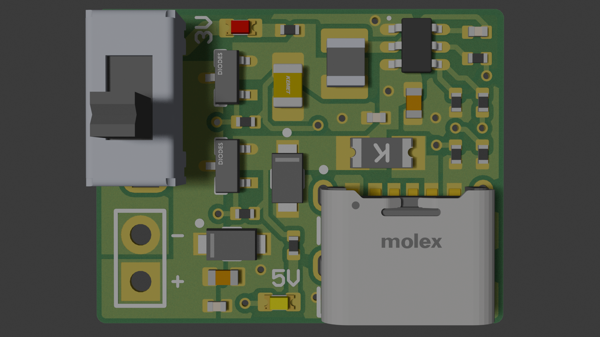

# USB-C Bench PSU

A compact, fully analogue USB-C bench power supply providing regulated **3.3V** and **5V** output rails with individual switching, overcurrent protection, and ESD suppression. Designed for breadboard prototyping and bench use.

> **Open Source Hardware** · Licensed under [CERN-OHL-S-2.0](LICENSE)


---

---
## Specifications

| Parameter | Value |
|---|---|
| Input | USB-C, 5V default (no PD negotiation required) |
| Output Rails | 3.3V regulated, 5V passthrough |
| 3.3V Regulator | TI TPS563201 synchronous buck, up to 2A continous |
| Output Switching | Per-rail P-channel MOSFET (AO3401A) via SPDT slide switch |
| Input Protection | 1206 PTC fuse (2A hold / 3.5A trip) |
| ESD Protection | SMF6.0A/5.0A TVS diodes on both input/output  rails |
| LED Indicators | White (5V rail active), Red (3.3V rail active) |
| Passives | 0402 resistors, 0402–0805 capacitors |
| Surface Finish | ENIG recommended |
| Assembly | Single-side (top only), JLCPCB compatible |
| Footprint | 22mm x 17mm |

## Features

- **No firmware.** Fully analogue, plug in and it works.
- **Independent rail switching.** SPDT slide switch controls both output rails via P-channel MOSFETs, select 3.3V or 5V.
- **USB-C with proper enumeration.** 5.1kΩ CC pulldown resistors ensure correct 5V @ up to 3A negotiation from **any** USB-C source.
- **Robust protection.** PTC resettable fuse on VBUS, TVS clamping on output rails.
- **Visual feedback.** Dedicated LED per rail. white for 5V, red for 3.3V.
- **Compact.** Minimal footprint, all components on one side for low-cost assembly.

## Repository Structure

```
usb-c-bench-psu/
├── README.md
├── LICENSE
├── CHANGES.txt
├── NOTICE.txt
├── cern_ohl_s_v2_user_guide.pdf
├── Hardware/
│   ├── Schematics/
│   │   ├── USB-C_BENCH_PSU.SchDoc      # Altium schematic source
│   │   └── USB-C_BENCH_PSU.pdf         # Schematic PDF export
│   ├── PCB/
│   │   ├── USB-C_BENCH_PSU.PcbDoc      # Altium PCB source
│   ├── Gerbers/
│   │   ├── USB-C_BENCH_PSU_Gerbers.zip
|   |   └── USB-C_BENCH_PSU_Pick_And_Place.csv
│   └── BOM/
│       └── USB-C_BENCH_PSU_BOM
├── Docs/
│   ├── USB-C_BENCH_PSU_Datasheet.pdf
│   ├── USB-C_BENCH_PSU_Datasheet.html
│   └── USB-C_BENCH_PSU_Assembly_Drawing.pdf
└── Renders/
    ├── top.png
    ├── bottom.png
    └── USB-C_BENCH_PSU_3D.pdf          # 3D PDF export
```

## Bill of Materials

| Ref | Value | Package | LCSC Part # | Qty |
|---|---|---|---|---|
| IC1 | TPS563201DDCR | SOT-23-6 | C116592 | 1 |
| J1 | USB-C 6-pin receptacle | 217175-0001 | C668623 | 1 |
| L1 | 3.3µH inductor | 1008 | C5832373 | 1 |
| Q1, Q2 | AO3401A P-ch MOSFET | SOT-23 | C15127 | 2 |
| F1 | PTC fuse | 1206 | C2685749 | 1 |
| S1 | SPDT slide switch | SS12D07VG4 | C2939726 | 1 |
| D1 | SMF6.0A TVS | SOD-123FL | C2857264 | 1 |
| D2 | SMF5.0A TVS | SOD-123FL | C2857263 | 1 |
| D3 | White LED | 0603 | C2290 | 1 |
| D4 | Red LED | 0603 | C2286 | 1 |
| C4 | 47µF | 0805 | C19103846 | 1 |
| C2, C5 | 22µF | 0603 | C20416425 | 2 |
| C1, C3, C6 | 100nF | 0402 | C1525 | 3 |
| R1, R2 | 5.1kΩ | 0402 | C25905 | 2 |
| R3, R6, R7 | 100kΩ | 0402 | C25741 | 3 |
| R4 | 33.2kΩ | 0402 | C2930001 | 1 |
| R5 | 10kΩ | 0402 | C25744 | 1 |
| R8 | 330Ω | 0402 | C25104 | 1 |
| R9 | 220Ω | 0402 | C25091 | 1 |
| JMP1 | Jumper | 2-pin TH | — | 1 |

All SMD parts are JLCPCB basic or extended parts. JMP1/J1 is through-hole.

## Getting Started
> **⚠️ Warning:** Disconnect loads before switching from 5V to 3.3V mode. The 5V rail backfeeds
> through Q1's body diode, and the output will briefly exceed 3.3V during the transition. This can
> damage 3.3V-rated components. Switching from 3.3V to 5V is safe. In general, it is best practice to
> disconnect any load when handling anything with power to avoid accidental damage to sensitive and/or expensive equipment.
1. **Connect power.** Plug a USB-C cable into J1 from any USB-C charger or port. Use a USB-C to USB-C cable for best results (cheap USB-A to USB-C cables sometimes omit CC wires, which may limit current to 500mA.)
2. **Select output.** Slide switch S1 to select the 3.3V or 5V output rail. The white LED (D3) indicates 5V is active; the red LED (D4) indicates 3.3V is active.
3. **Connect your circuit.** Output is available on the header pins / pads. 3.3V and 5V rails are independently switched.

## Design Notes

**3.3V regulation:** The TPS563201 is configured as a synchronous buck converter with a 3.3µH inductor and a feedback divider of 33.2kΩ / 10kΩ, producing a regulated 3.3V output from the 5V USB input.

**Output switching:** Both rails are controlled by AO3401A P-channel MOSFETs (85mΩ Rds(on)) with gate pull-up resistors. The SPDT switch S1 selects which rail(s) are enabled.

**Protection:** F1 is a resettable PTC fuse protecting against overcurrent on VBUS. D1 and D2 are TVS diodes clamping transients on the output rails. The CC pulldown resistors (R1, R2 = 5.1kΩ) handle USB-C enumeration for default 5V power.

## Manufacturing

### JLCPCB Assembly

1. Upload the Gerber ZIP from `Hardware/Gerbers/`
2. Enable SMT assembly, top side only
3. Upload the BOM CSV and pick-and-place file from `Hardware/Gerbers/`
4. S1 and JMP1 are through-hole — solder these manually after boards arrive

JLCPCB's assembly stock is a separate inventory from LCSC's retail catalogue. A part in stock on LCSC may be unavailable for JLCPCB assembly. Check part availability in their assembly parts search before ordering.

### Self-Assembly (Hotplate Reflow)

Order a stencil with your PCB. Hand-dispensing paste on 0402 pads leads to tombstoning. Apply paste through the stencil, place all SMD components, then reflow on a hotplate or hot air station.

The USB-C connector (J1) has high thermal mass and reaches reflow temperature after the surrounding passives. Pre-heat longer than expected, or touch up J1 with an iron after reflow. S1 and JMP1 are through-hole and need to be soldered by hand after reflow.

Component designators are not on the silkscreen due to board size constraints. Refer to the assembly drawing or PCB layout to identify component placement.

Inspect all 0402 joints under magnification before powering on.

### Ordering Individual Parts

All SMD parts are available on LCSC with part numbers in the BOM, if out of stock find similar components with same/better spec. Minimum order quantities are typically 10–50 pieces, so unless you have a 10+ boards, you will have parts left over. LCSC and JLCPCB are sister companies, combine shipping if ordering boards and parts together.

## License

This project is licensed under the **CERN Open Hardware Licence Version 2 - Strongly Reciprocal (CERN-OHL-S-2.0)**.

You may use, modify, and distribute this design freely. Any modifications must also be released under the same licence. See [LICENSE](LICENSE) for full terms.

Documentation (datasheet, assembly drawing, and README) is licensed under [CC-BY-SA-4.0](https://creativecommons.org/licenses/by-sa/4.0/).

## Contributing

Issues and pull requests are welcome. If you manufacture this board, I'd genuinely appreciate hearing about your experience, feel free to file an issue or reach out.
